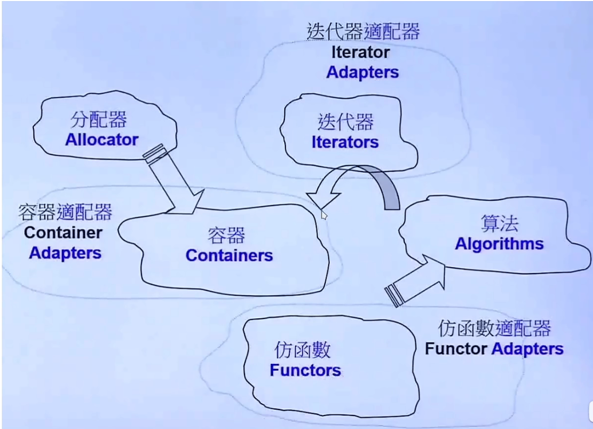

# Container

STL主要由以下五模块组成，分别是分配器(Allocator)，迭代器(Iterrators)，容器(Containers)，算法(Algorithms)，仿函数(Functors)。他们之间的关系如下表示。



* 算法通过迭代器操控容器

### Vector

```cpp
#include<vector>
using namespace std;
int main()
{
    vector<int> v={1,2,3,4};
    return 0;
}
```

* vector 的功能是长度可变的数组，数据存储在堆上。
* vector 是一个模板类，第一个模板参数是元素类型。
* vector可以在初始化的时候指定大小。

```cpp
vector<int> v(4);//大小为4的int类型vector
```

#### resize

resize 的大小若**大于**当前容量，则会在内存中重新分配空间，将数据全部拷贝过去后，再释放掉原本的空间。

因此若是之前有个指针指向这个vector，则变成空悬指针导致数据错误，若该内存区域被操作系统收回，则会引发段错误，导致程序中断。

若**小于**当前容量，则不会重新分配空间，而且原来的空间也不会被释放，只是size标志位改变，因此之前指向这个vector的指针不会空悬。

#### push_back

push_back若超过容量则会自动扩容到2倍，以防止频繁的拷贝。