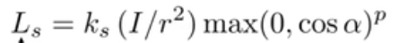
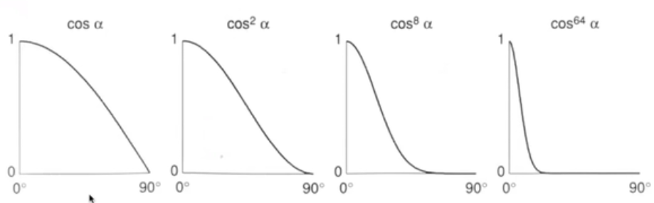
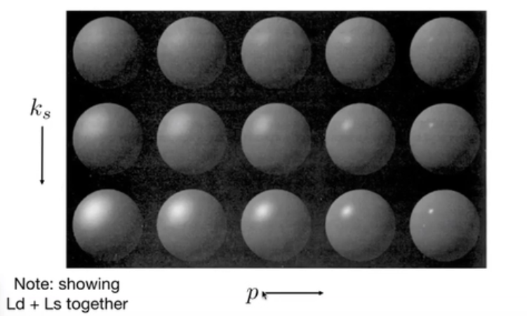
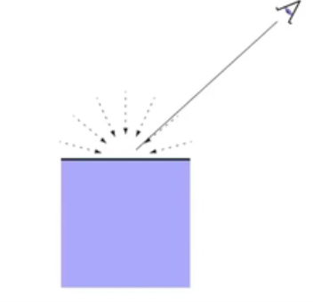
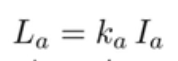
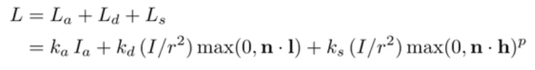

# Computer Graphic Lecture 6 Blinn-Phong Reflection Model

#### 直观上的感受（Perceptual Observation）

我们人眼能看见物体，是因为有光打到物体上，然后再反射到人眼中，光打到物体上，直观上大致可以分成三个区域（黑，百，灰）也就是素描中所说的暗部， 高光，灰部。仔细观察其实可以看到暗部并非完全黑的，也是会有一些光照表现，那个就是环境光。

比较物理的表述就是Ambient lighting（环境光）,Diffuse reflection（漫反射）,Specular highlights（高光）。

#### Light source

先来介绍光源。

##### Point light 

点光源，顾名思义，就是光从一点发出。向四周发散，因此需要两个参数：位置（Position）,强度(Intensity)。

要怎末求离光源距离为r处的光线强度捏？

根据能量守恒定律，应该是距离的平方反比的关系。

可以这么想象，要接受点光源所有的光照，就必须用一个球壳包住它，如果距离越远，则球壳的表面积就要越大，而且是平方的关系。则球壳上单位面积接收到的光线就是平方反比的关系。

##### Direction light

直射光源可以用光强无限大，距离无限远的点光源表示，就像太阳一样。

直射光源有方向，且光强不变，也就是说入射光线的属性是固定的。

#### Blinn-Phong Reflection Model

##### Diffuse reflection（漫反射）

一束光打到一个不可能绝对光滑的表面，必然会发生漫反射。

漫反射的特性：

Diffuse light is scattered uniformly in all directions.（漫反射光线是发散向所有的方向的光线）

这意味着无论你在哪个方向看，看到的漫反射表面都是一样的,也就是说你看到漫反射的效果和你看的方向无关。

 													

那么为什么物体表面会出现明显的由亮到暗的过渡变化捏？

这和光线与表面法线的夹角有关，我们人眼直观上的感受亮暗，实际上就是单位表面积接收光的能量的大小。地球上为什么纬度越高光照就越不足捏，就是这个道理（可以根据下图理解一些）。

如同可以计算出单位表面积接收的光线能量。就是乘光线与法线夹角的余弦值。

对于点光源则有表达式

此处kd为扩散系数，一般为表面的颜色。因为不同的颜色对于光线的能量吸收不同。

这样得出Ld为表面的漫反射光。

##### Specular highlights（高光）

高光就是物体表面的反射光线直接射入眼睛，就像镜子一样（可以大致理解为镜面反射），因此能量最高，最亮。

从原理上看，高光与看的方向和反射光线的方向密切相关，但是一般不会直球地求反射光线，而是会求入射光线和看的方向半程向量。这样比较省计算量。

类比漫反射的公式，可以得出

  然而我们可以注意到有个p次方，这是干什么的呢？

可以看出p值越大，变化得就越剧烈，这意味着高光的集中程度。

##### Ambient lighting（漫反射）

环境光是很复杂的，设计到光在各种物体之间的各种反射，衍射，我们可以简化它，假设表面接收到的环境光是恒定不变的（当然这是一种假设情形）。

则有

##### Blinn-Phong Reflection Model

将这三项加起来就是Blinn-Phong Reflection Model

即

