## Classification

#### Description

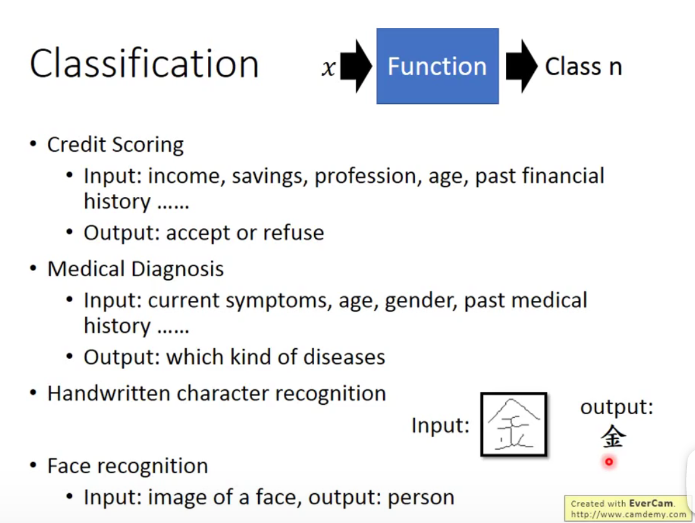

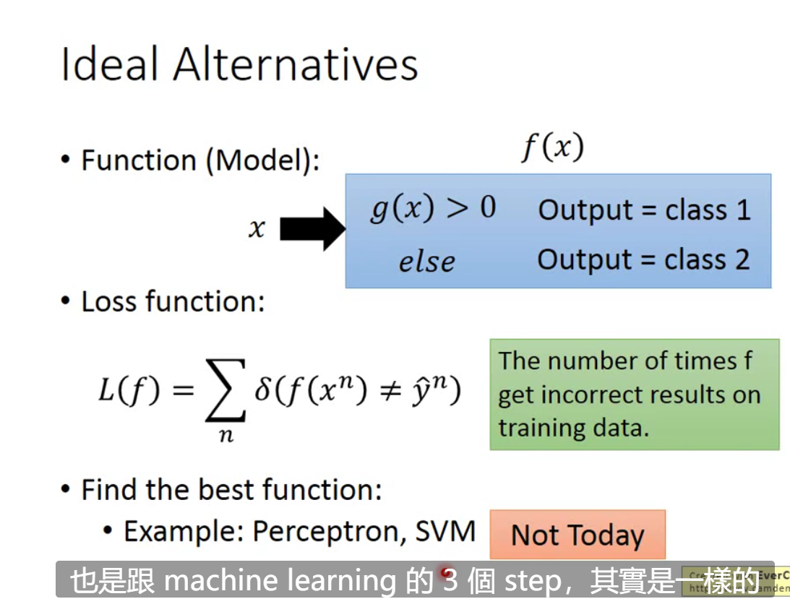

There are two ways to define your function. Logistic Regression and Generation.

#### Bayes Probability 

As for binary classification problem,The key to knowing which class the target belongs to is calculating its Bayes Probability between two class.

The fallowing picture show the Bayes Formula.

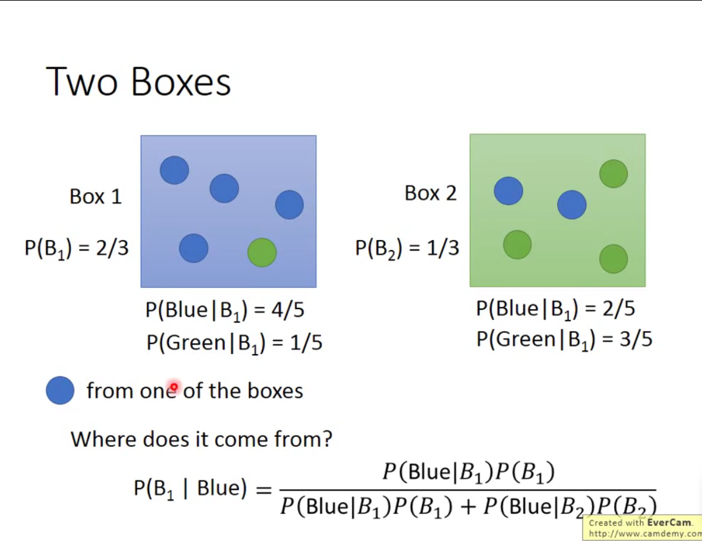

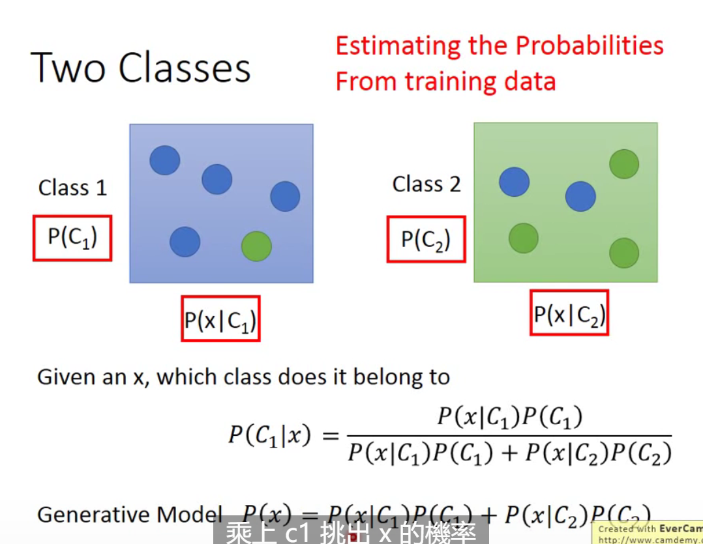

However, There are some problems about how to calculate the probability that pick x from C1.(P(x|C1)).

Because the C1 isn't a continuous area,so we have to find a method to get a area form discrete date.

#### Gaussian Distribution

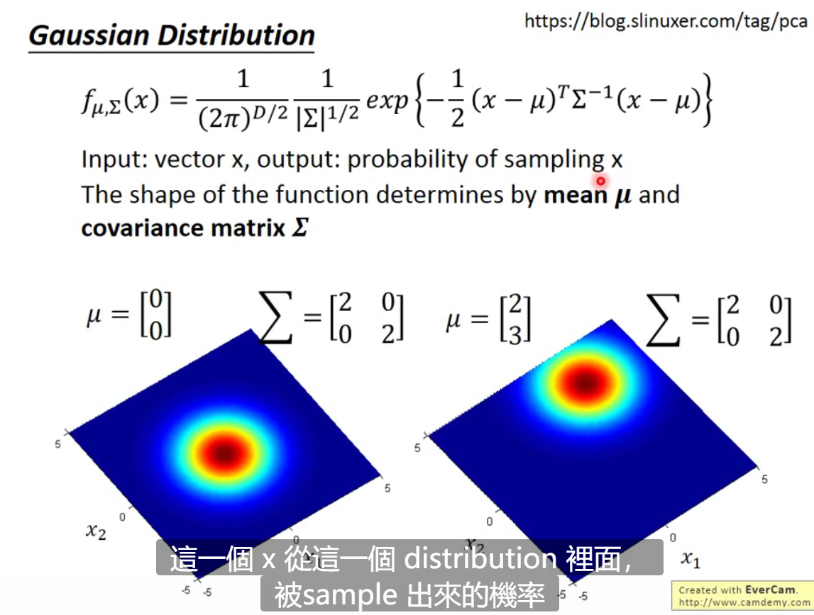

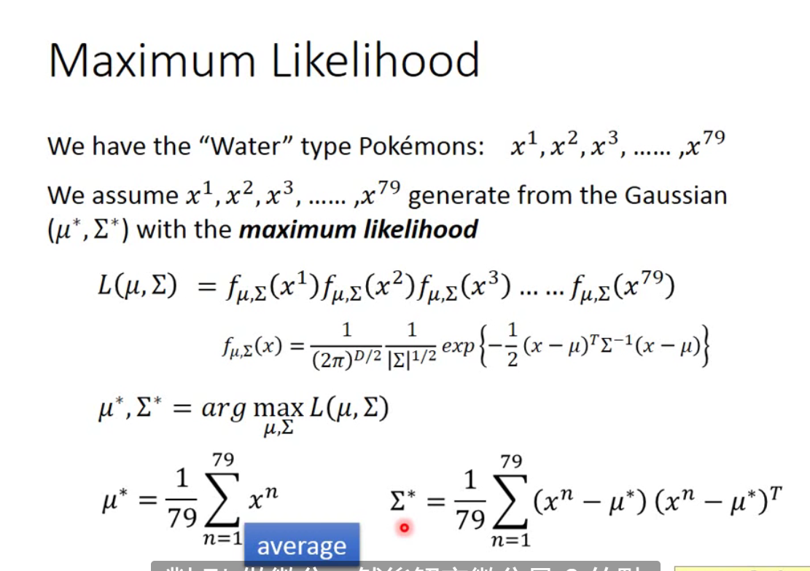

##### Combine Bayes Probability and Gaussian Distribution

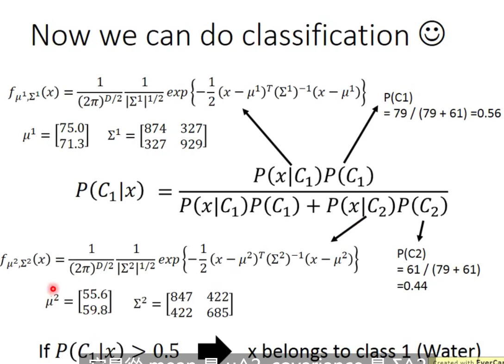

#### Optimization

We can try to let two classes share the same covariance,because the covariance is the square of the variance,Sometimes it will seems too large and effect the result.

The new covariance is the weighted overage between two covariance.

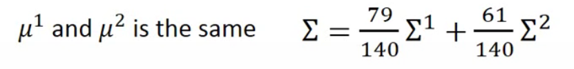

 Now we can simplify our function.

##### Mathematical derivation

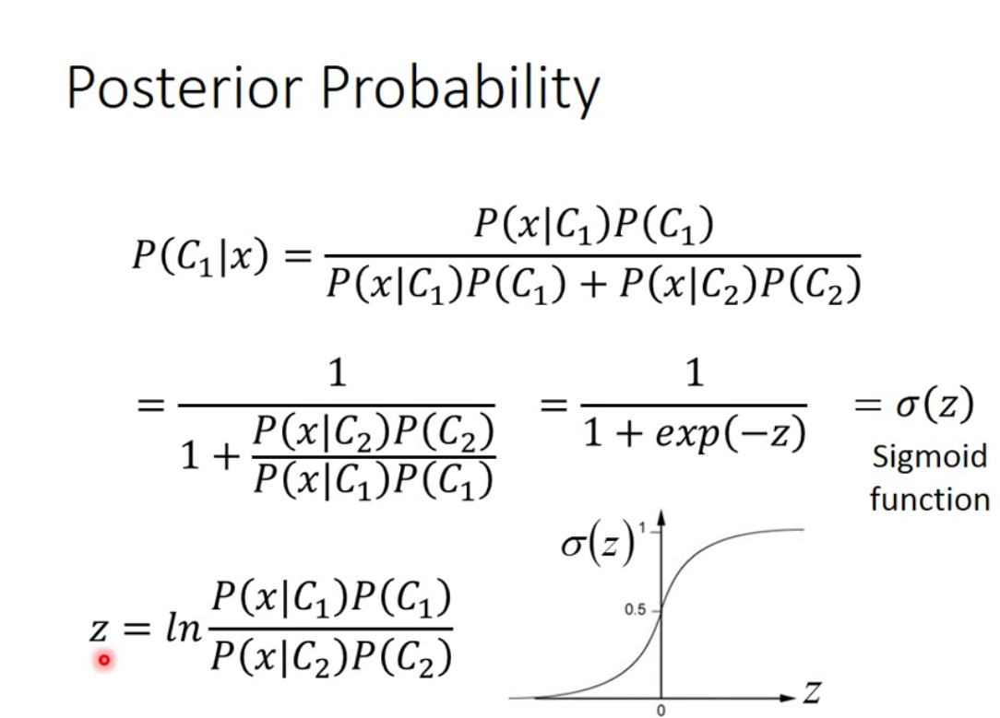

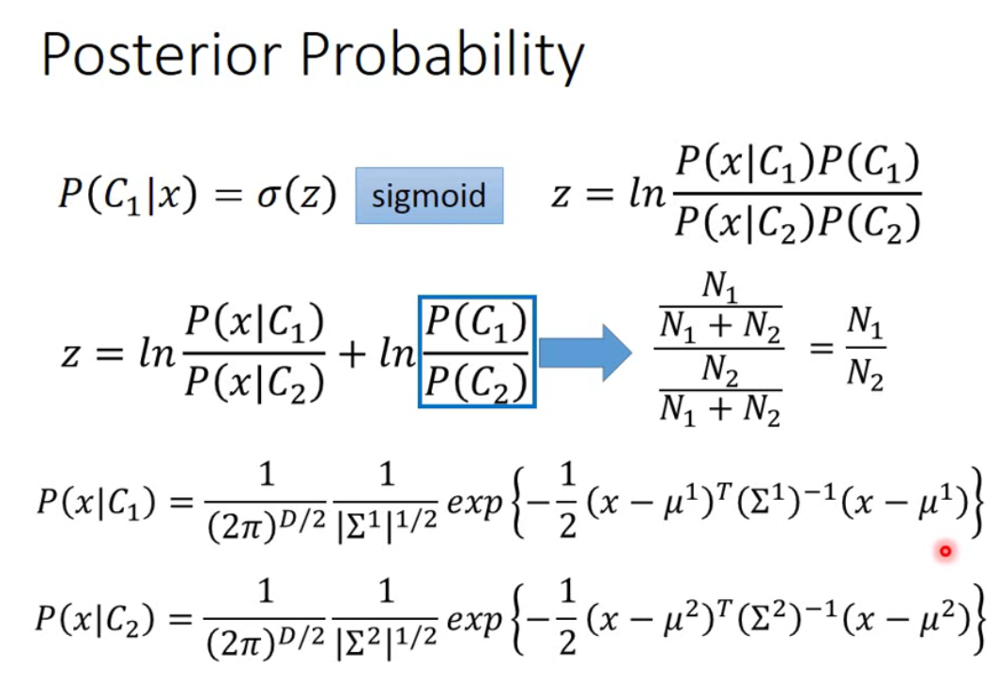

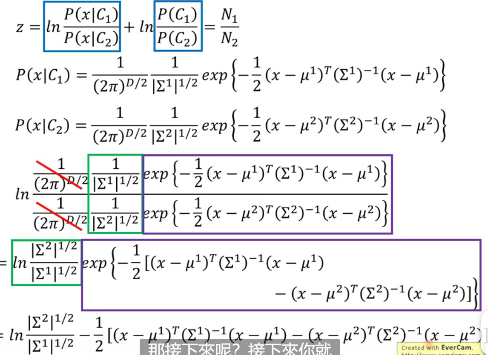

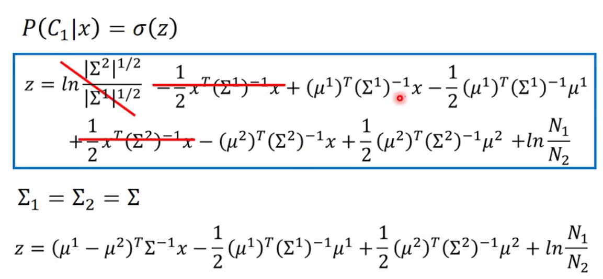

Now we get our finally function,It is interesting that the result seems like a linear model.

So that we can writer out our finally function as fallow.

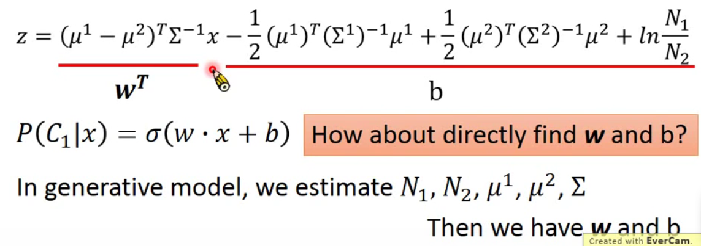

#### The difference between Logistic Regression and Generative

Now there are two ways to training our model,

we can calculate it as a linear mode and train w and b directly, it was named Logistic Regression

Another way is calculate it as a model whose parameters is 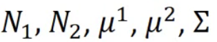 ,It was called Generative.

